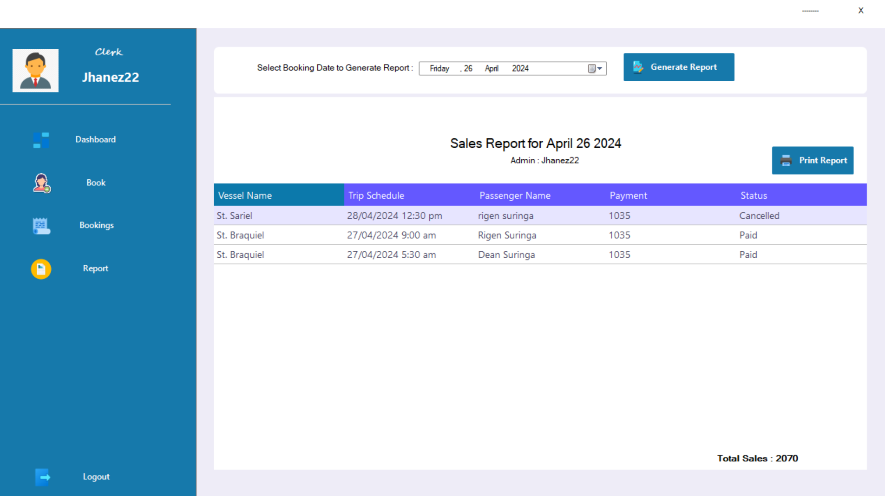

# Project Name




## Description
A brief description of the project.

## Features
- Feature 1
- Feature 2
- Feature 3

## Screenshots

### Home Page


### Dashboard


### Settings Page


## Installation
```sh
# Clone the repository
git clone https://github.com/user/repo.git

# Navigate to the project directory
cd repo

# Install dependencies
npm install

# Start the application
npm start
```

## Usage
1. Open the application.
2. Log in or register.
3. Navigate through the features.

## Contributing
Pull requests are welcome. For major changes, please open an issue first to discuss what you would like to change.

## License
[MIT](https://opensource.org/licenses/MIT)
